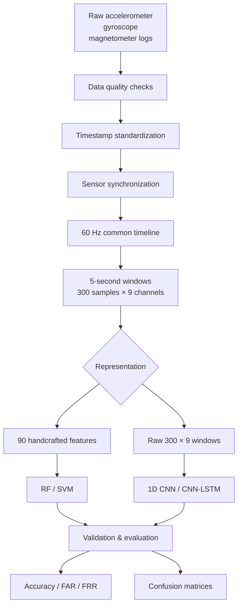
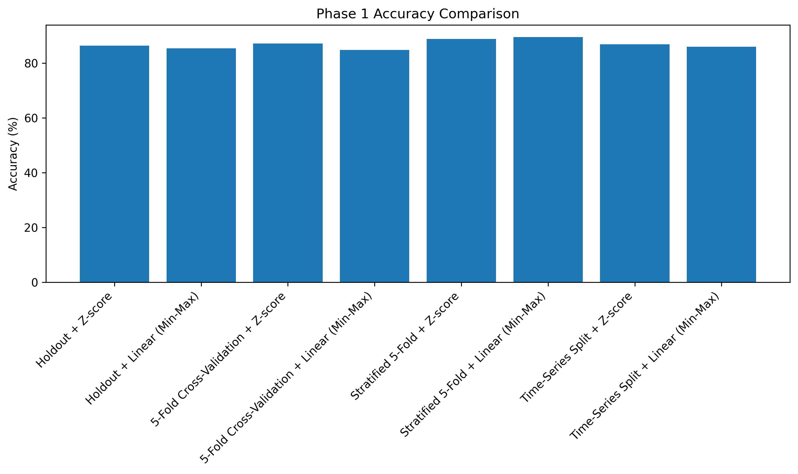
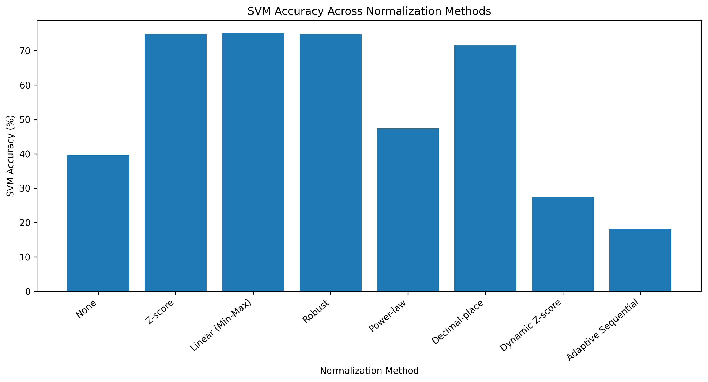
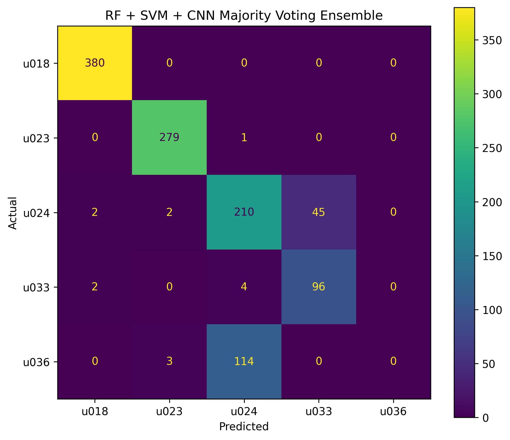
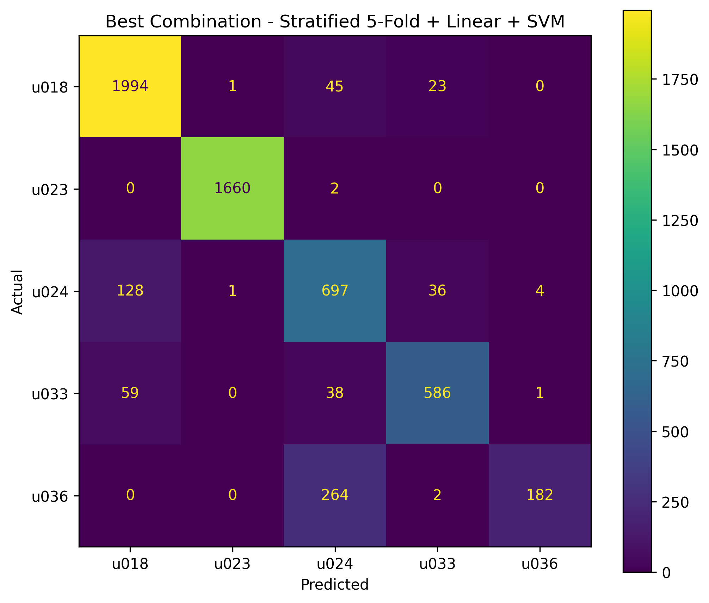

# Parkinson Sensor ML

### Sensor-Based Movement Analysis for Parkinson's Research


An end-to-end sensor-processing and machine-learning pipeline using **accelerometer, gyroscope, and magnetometer** signals for movement analysis.

> **Current phase:** Phase 1 pipeline validation using the IDNet sample dataset.  
> The Phase 1 experiment uses user-identity labels to validate the processing and evaluation pipeline. It is **not a clinical Parkinson's diagnostic model**.

---

## Why this project?

Wearable and inertial sensors produce multichannel time-series data with different sampling rates, scales, and recording sessions. Before a model can be trusted, the data pipeline itself needs to be tested carefully.

This project therefore focuses on the full workflow:

**raw sensor logs → synchronization → windowing → feature engineering → normalization → ML/DL → validation → error analysis**

---

## Pipeline



---

## Sensors

| Sensor | Axes | Channels |
|---|---|---:|
| Accelerometer | X, Y, Z | 3 |
| Gyroscope | X, Y, Z | 3 |
| Magnetometer | X, Y, Z | 3 |
| **Total** | | **9** |

The sensors are synchronized onto a **60 Hz master timeline** before fixed-length windowing.

---

## Windowing

Each synchronized recording is divided into:

- **Window length:** 5 seconds
- **Sampling rate:** 60 Hz
- **Samples per window:** 300
- **Channels:** 9
- **Overlap:** 50%

So each raw input window has shape:

```text
300 × 9
```

---

## Feature Engineering

Each raw window is converted into **90 handcrafted features**:

**Per channel**

- Mean
- Standard deviation
- Minimum
- Maximum
- Median
- Range
- RMS
- Zero-crossing rate
- Dominant frequency
- Spectral energy

**9 channels × 10 features = 90 features**

---

## Models Evaluated

| Model | Input |
|---|---|
| Random Forest | 90 handcrafted features |
| SVM | 90 handcrafted features |
| 1D CNN | Raw 300 × 9 windows |
| CNN-LSTM | Raw 300 × 9 windows |

---

## Phase 1 Results

### Baseline models

| Model | Final held-out test accuracy |
|---|---:|
| Random Forest | **74.18%** |
| SVM | **74.79%** |
| 1D CNN | **74.69%** |
| CNN-LSTM | **53.35%** |

The CNN-LSTM also reached **98.71% validation accuracy** in one experiment but only **53.35% final test accuracy**, highlighting the importance of recording-level evaluation and generalization analysis.

### Normalization experiment

| Normalization | SVM accuracy |
|---|---:|
| None | 39.71% |
| Z-score | 74.79% |
| Linear / Min-Max | 75.15% |
| Robust | 74.79% |
| Decimal-place | 71.62% |
| Power-law | 47.38% |
| Dynamic Z-score | 27.53% |
| Adaptive Sequential | 18.15% |

These results describe this specific Phase 1 experiment and should not be interpreted as universal performance claims about normalization methods.

### Validation study

Four validation strategies were evaluated:

- Holdout
- 5-Fold Cross-Validation
- Stratified 5-Fold Cross-Validation
- Time-Series Split

The strongest completed configuration in the current Phase 1 record was:

> **Stratified 5-Fold + Linear (Min-Max) + SVM**

| Metric | Result |
|---|---:|
| Pooled accuracy | **89.45%** |
| FAR | **2.73%** |
| FRR | **19.34%** |

---

## Visual Results

### Overall model comparison



### Normalization comparison



### Ensemble confusion matrix



### Best completed confusion matrix



---

## Ensemble Experiment

A simple majority-voting ensemble was evaluated using:

- Random Forest
- SVM
- 1D CNN

on a common holdout set.

| Approach | Accuracy |
|---|---:|
| Random Forest | 84.01% |
| SVM + Z-score | 86.20% |
| 1D CNN + Z-score | 76.63% |
| RF + SVM + CNN voting | 84.80% |

The ensemble did not improve on the SVM in this experiment, which is itself a useful result: combining models does not automatically improve performance when their prediction errors are not sufficiently complementary.

---

## A Key Generalization Finding

One of the main lessons from Phase 1 was the difference between validation performance and final held-out performance.

The CNN-LSTM experiment produced:

```text
Validation accuracy : 98.71%
Final test accuracy : 53.35%
```

This motivated closer inspection of recording-level splits, session variability, and potential overfitting.

---

## Dataset

The raw sensor dataset is **not included** in this repository.

This repository is intended to contain the **code, methodology, selected results, visualizations, and documentation**. Obtain and use the dataset only from its authorized source and according to its terms.

---

## Repository Structure

```text
parkinson-sensor-ml/
│
├── README.md
├── .gitignore
├── requirements.txt
│
├── notebooks/
│   └── 01_understand_data.ipynb
│
└── results/
    ├── figures/
    └── tables/
```

---

## Running the Project

Create a Python environment and install the required packages:

```bash
pip install -r requirements.txt
```

Then launch Jupyter:

```bash
jupyter notebook
```

Place the authorized dataset in the expected local data directory before running the notebook.

---

## Phase 1 Status

### Completed

- Sensor data quality checks
- Timestamp and synchronization analysis
- 60 Hz resampling/interpolation
- 5-second windowing
- 90-feature extraction
- Random Forest
- SVM
- 1D CNN
- CNN-LSTM
- Normalization experiments
- Holdout validation
- 5-Fold Cross-Validation
- Stratified 5-Fold Cross-Validation
- Time-Series Split
- FAR / FRR analysis
- Confusion matrices
- Majority-voting ensemble

### Next phase

Apply the validated pipeline to the **actual Parkinson-labelled dataset**, subject to final confirmation of the required normalization procedures, evaluation conventions, and dataset protocol.

---

## Research Notes

Phase 1 is a **pipeline-validation study**. The results shown here are experimental results from the current sample dataset and are not presented as clinical efficacy or diagnostic performance.

---

## Author

**Sai Sreevatsal**

B.Tech — Electronics and Communication Engineering  
IoT & Embedded Systems
